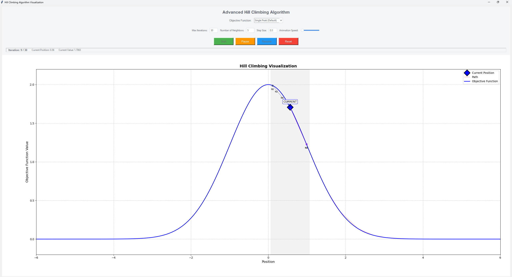

# Hill Climbing Algorithm Visualization

An interactive visualization tool for demonstrating the hill climbing optimization algorithm. This educational application allows users to explore how hill climbing works on various objective functions and observe the algorithm's strengths and limitations.


*(Add a screenshot of the application here)*

## Features

- **Interactive Animation:** Watch the hill climbing algorithm work step-by-step with start, pause, resume, and reset functionality
- **Multiple Objective Functions:** Choose from 8 different objective functions that highlight different aspects of hill climbing:
  - Single Peak (Default)
  - Two Peaks
  - Long Straights
  - Complex (3 Peaks)
  - Many Local Optima
  - Narrow Peak
  - Deceptive Gradient
  - Plateau & Cliff
- **Customizable Parameters:**
  - Adjust maximum iterations
  - Configure number of neighbors to explore
  - Set step size (affects exploration range)
  - Control animation speed
- **Real-time Visualization:**
  - See neighbors being generated
  - Watch as the algorithm evaluates and selects the best neighbor
  - Observe the smooth transition to new positions
  - Follow the path taken by the algorithm

## How It Works

Hill climbing is a simple optimization algorithm that:
1. Starts at a random position
2. Generates random neighbors within a given step size
3. Evaluates each neighbor using the objective function
4. Moves to the best neighbor if it's better than the current position
5. Repeats until no better neighbor is found or the maximum iterations are reached

The visualization shows each step of this process, making it easier to understand how hill climbing works and why it might get stuck in local optima.

## Neighborhood Mechanism

The neighborhood generation is a critical component of the hill climbing algorithm:

1. **Random Neighbor Generation:**
   - Each neighbor is generated randomly within the step size distance from the current position
   - The formula used is: `neighbor = current_x + (random.random() * 2 - 1) * step_size`
   - This creates neighbors that are at most `step_size` distance away from the current position in either direction

2. **Number of Neighbors:**
   - The algorithm generates the specified number of neighbors (default: 5) in each iteration
   - More neighbors increase the chance of finding better positions but require more evaluations

3. **Visual Representation:**
   - Each neighbor is shown as a colored dot connected to the current position by a line
   - The best neighbor is highlighted (yellow if better than current, orange if not better)
   - All other neighbors are removed to focus on the best neighbor

4. **Movement Decision:**
   - If the best neighbor has a higher objective function value than the current position, the algorithm moves there
   - If no neighbor is better, the algorithm stops and identifies the current position as a local optimum

This neighborhood mechanism creates a balance between exploration (trying different areas) and exploitation (moving to better positions). The step size parameter controls this balance - larger values allow for more exploration but might miss fine details, while smaller values provide precision but might get stuck in local optima.

## Installation

### Prerequisites
- Python 3.6 or higher
- pip (Python package installer)

### Required Libraries
- NumPy
- Matplotlib
- Tkinter (usually comes with Python)
- ttkthemes (for modern UI appearance)

### Setup

1. Clone the repository:
```bash
git clone https://github.com/alierenaltindag/hill-climbing-visualized.git
cd hill-climbing-visualization
```

2. Install required dependencies:
```bash
pip install -r requirements.txt
```

## Usage

Run the visualization tool:
```bash
python hill_climbing.py
```

### Interface Guide:

- **Objective Function:** Select from the dropdown menu to change the function being optimized
- **Max Iterations:** Set the maximum number of iterations before stopping
- **Number of Neighbors:** Configure how many neighbors to generate at each step
- **Step Size:** Control how far from the current position neighbors can be generated (accepts both period and comma for decimal values)
- **Animation Speed:** Adjust how fast the visualization runs (higher values = faster animation)
- **Control Buttons:**
  - Start: Begin the animation
  - Pause: Temporarily stop the animation
  - Resume: Continue from where you paused
  - Reset: Start fresh with a new random position

## Educational Value

This tool is designed for educational purposes to help students and researchers:
- Understand how hill climbing works visually
- Explore the impact of different parameters on optimization performance
- See why hill climbing can get stuck in local optima
- Learn about different types of objective function landscapes
- Visualize the exploration vs. exploitation tradeoff

## Objective Function Descriptions

- **Single Peak (Default):** A simple function with one Gaussian peak to demonstrate basic hill climbing behavior
- **Two Peaks:** Function with two Gaussian peaks to demonstrate simple optimization with multiple optima
- **Long Straights:** Features gradual slopes that show how step size affects convergence speed
- **Complex (3 Peaks):** Three peaks including two close together to show how the algorithm can find local vs. global optima
- **Many Local Optima:** Multiple local maxima to demonstrate how easily hill climbing gets stuck
- **Narrow Peak:** A tall, narrow peak among broader hills to show how step size selection is critical
- **Deceptive Gradient:** A function where the gradient leads to a local optimum, but a better global optimum exists elsewhere
- **Plateau & Cliff:** A nearly flat region followed by a steep climb to demonstrate the challenges of navigating different gradient magnitudes